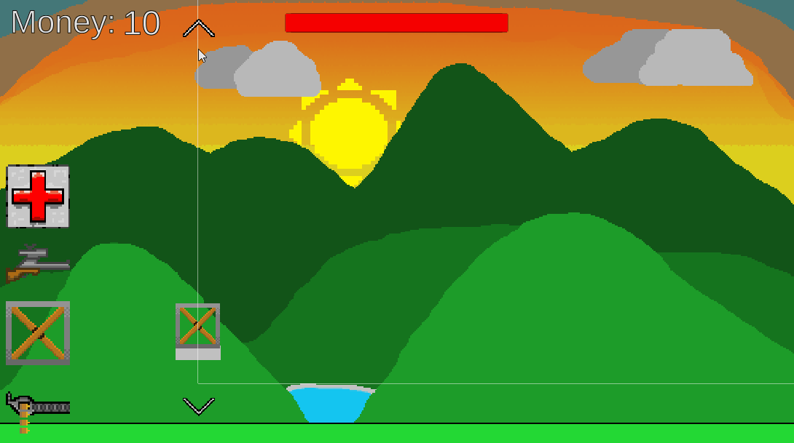
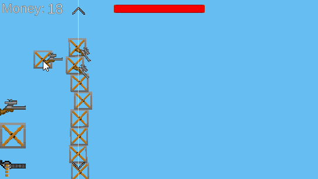

# GMTKJam2018 - Crammed Defense

My submission for the GMTKJam2018

## Theme

The theme for this game jam was:
_Genre_ but you can't _Mechanic_

My interpretation was a _tower defense_ but you can't _place more than one tower_.

## Description

Defend your castle by getting creative in the limit space you get.

Everything is made by myself in under 48 hours while having to go to work asswel.

### Tools

* Unity
* Photoshop
* Audacity
* Visual Studio

## Some mid development gif's (Not finished at this point)

